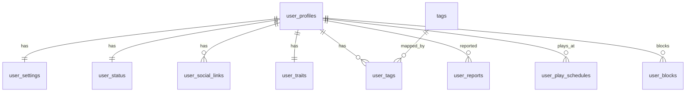
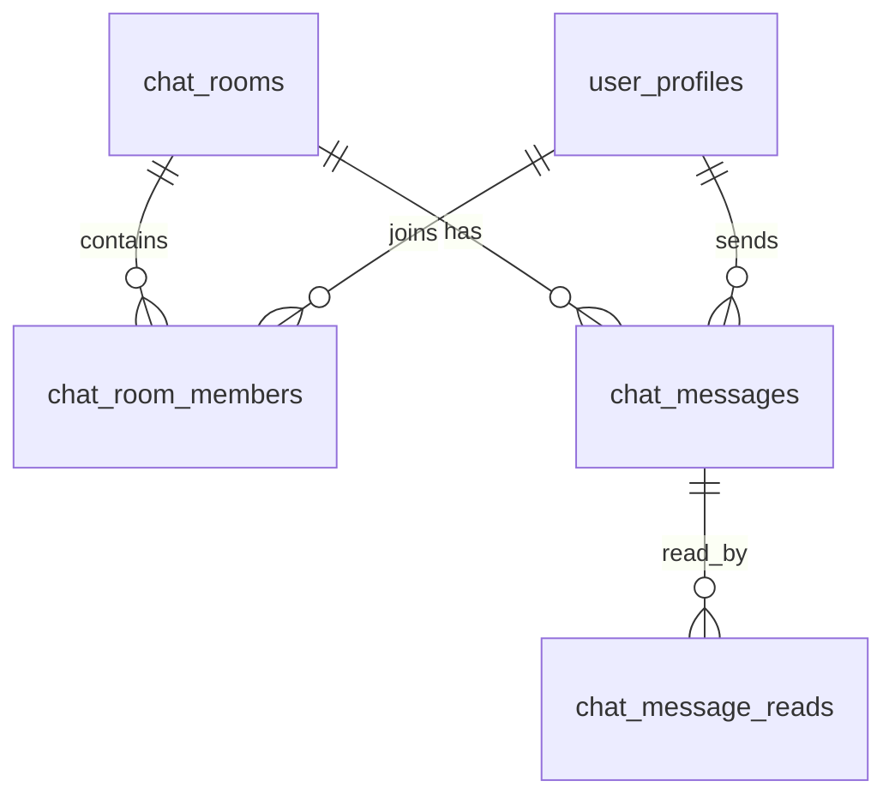
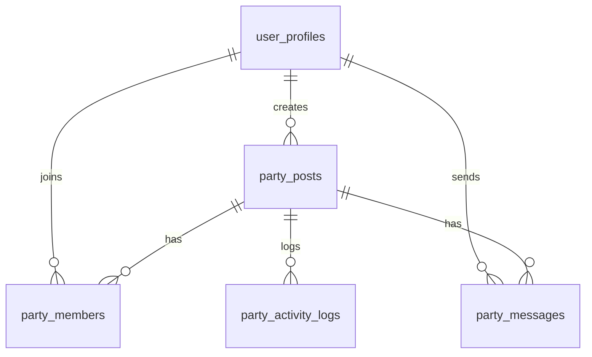
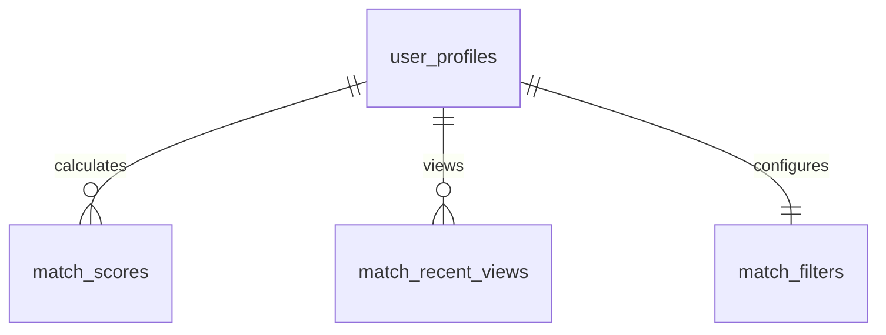
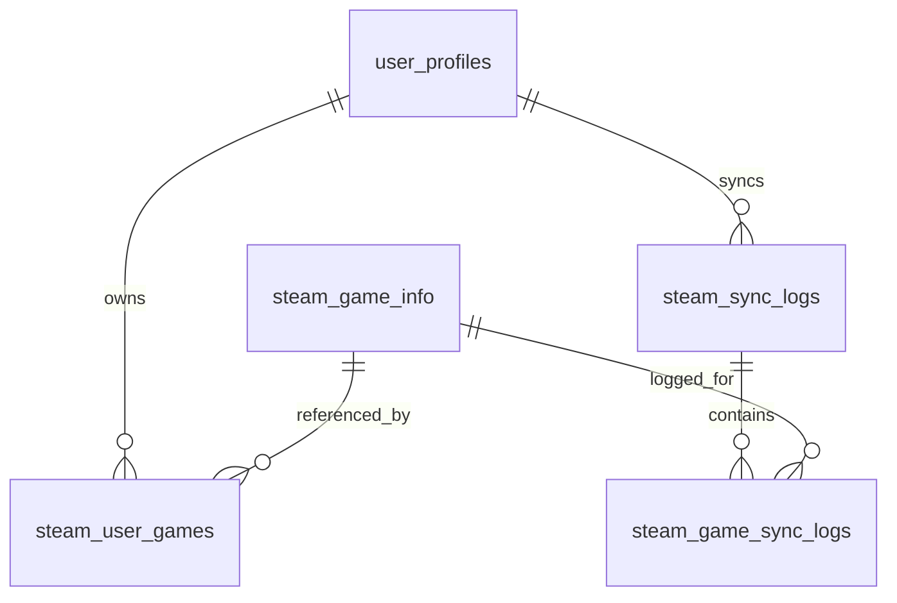
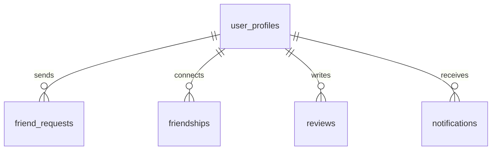
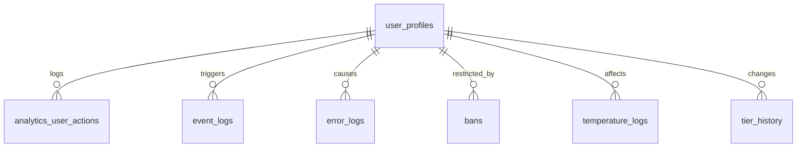

# Domain ERD

본 문서는 ReadyGo 서비스의 도메인별 데이터베이스 구조를 ERD로 시각화한 문서이다.

## 기준 (Source of Truth)

- Supabase 실제 DB
- `database.types.ts`
- `01-schema-analysis.md`

📌 본 문서는 구조 시각화 목적이며, 컬럼 상세 정의·nullable 여부·제약 조건은 `01-schema-analysis.md`를 기준으로 한다.

---

### 1️⃣ User / Profile Domain

- 유저의 기본 프로필, 설정, 성향, 태그, 신고, 차단 정보를 관리
- auth.users는 논리적 기준이며 ERD에는 포함하지 않음

---

### 2️⃣ Chat Domain

- 1:1 및 그룹 채팅 구조
- 채팅방, 참여자, 메시지, 읽음 상태 포함

---

### 3️⃣ Party Domain

- 파티 모집, 참여, 파티 채팅 및 활동 로그 관리
- 파티 단위의 독립된 커뮤니케이션 구조

---

### 4️⃣ Match Domain

- 유저 성향 기반 매칭 결과 및 필터
- 매칭 점수와 최근 조회 이력 관리

---

### 5️⃣ Steam Integration Domain

- Steam 계정 연동 후 수집된 게임 데이터 관리
- 게임 메타데이터와 유저별 플레이 기록 분리

---

### 6️⃣ Social / Interaction Domain

- 친구 관계, 친구 요청, 후기, 알림 등
- 유저 간 상호작용 기록 관리

---

### 7️⃣ System / Logs Domain

- 서비스 운영을 위한 로그 및 상태 기록
- 분석 / 추적 / 관리 목적 데이터

---

본 문서는 도메인 단위의 구조적 관계 이해를 위한 ERD 문서이다.

- 컬럼 정의, Nullable, FK, UNIQUE 여부 → 01-schema-analysis.md
- 실제 타입 기준 → database.types.ts

📌 ERD는 분석 문서를 기반으로만 수정한다.

---

## Document Metadata

- **Author**: ReadyGo / Eunkyoung Kim(김은경)
- **Created At**: 2025-12-24
- **Last Updated At**: 2025-12-31
- **Document Version**: v1.0.4
- **Status**: Active
- **Source of Truth**:
  - Supabase Production Database
  - database.types.ts

## Version History

| Version | Date       | Description                                                    |
| ------: | ---------- | -------------------------------------------------------------- |
|  v1.0.0 | 2025-12-24 | Domain-level ERD diagrams                                      |
|  v1.0.1 | 2025-12-26 | Steam 도메인 ERD 수정                                          |
|  v1.0.2 | 2025-12-29 | User/Profile Domain에 user_status 추가                         |
|  v1.0.3 | 2025-12-29 | user_play_schedules 테이블 추가에 따른 ERD 수정                |
|  v1.0.4 | 2025-01-13 | chat_blocks를 user_blocks로 변경, User/Profile Domain으로 이동 |
