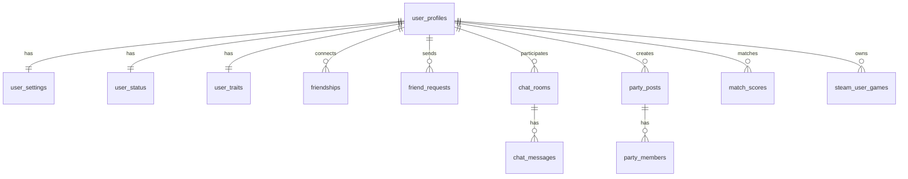

```mermaid
erDiagram
  %% =========================
  %% User / Profile Domain
  %% =========================
  user_profiles ||--|| user_settings : has
  user_profiles ||--|| user_status : has
  user_profiles ||--|| user_traits : has
  user_profiles ||--o{ user_social_links : has
  user_profiles ||--o{ user_tags : has
  tags ||--o{ user_tags : mapped_by
  user_profiles ||--o{ user_reports : reported
  user_profiles ||--o{ user_play_schedules : plays_at
  user_profiles ||--o{ user_blocks : blocks


  %% =========================
  %% Chat Domain
  %% =========================
  chat_rooms ||--o{ chat_room_members : contains
  chat_rooms ||--o{ chat_messages : has
  chat_messages ||--o{ chat_message_reads : read_by
  user_profiles ||--o{ chat_room_members : joins
  user_profiles ||--o{ chat_messages : sends

  %% =========================
  %% Party Domain
  %% =========================
  party_posts ||--o{ party_members : has
  party_posts ||--o{ party_messages : has
  party_posts ||--o{ party_activity_logs : logs
  user_profiles ||--o{ party_posts : creates
  user_profiles ||--o{ party_members : joins
  user_profiles ||--o{ party_messages : sends

  %% =========================
  %% Match Domain
  %% =========================
  user_profiles ||--o{ match_scores : calculates
  user_profiles ||--o{ match_recent_views : views
  user_profiles ||--|| match_filters : configures

  %% =========================
  %% Steam Integration Domain
  %% =========================
  user_profiles ||--o{ steam_user_games : owns
  steam_game_info ||--o{ steam_user_games : referenced_by

  user_profiles ||--o{ steam_sync_logs : syncs
  steam_sync_logs ||--o{ steam_game_sync_logs : contains
  steam_game_info ||--o{ steam_game_sync_logs : logged_for


  %% =========================
  %% Social / Interaction Domain
  %% =========================
  user_profiles ||--o{ friend_requests : sends
  user_profiles ||--o{ friendships : connects
  user_profiles ||--o{ reviews : writes
  user_profiles ||--o{ notifications : receives

  %% =========================
  %% System / Logs Domain
  %% =========================
  user_profiles ||--o{ analytics_user_actions : logs
  user_profiles ||--o{ event_logs : triggers
  user_profiles ||--o{ error_logs : causes
  user_profiles ||--o{ bans : restricted_by
  user_profiles ||--o{ temperature_logs : affects
  user_profiles ||--o{ tier_history : changes
```

# Full ERD (ReadyGo)

본 문서는 ReadyGo 서비스의 **전체 데이터베이스 구조를 단일 ERD로 통합 시각화**한 문서이다.

## Source of Truth

- Supabase 실제 DB
- database.types.ts
- 01-schema-analysis.md

📌 본 문서는 구조 이해 목적이며 컬럼 정의 / nullable / FK / UNIQUE 정보는 포함하지 않는다.

### Scope

포함:

- public schema 테이블 간 관계
- 도메인 간 연결 구조
- 유저 중심 데이터 흐름

제외:

- 컬럼 상세 정의
- Nullable / Default 값
- RLS, Trigger, Function
- auth schema (auth.users)

---

## Full Entity Relationship Diagram

📌 전체 구조를 빠르게 파악하기 위한
ERD 도메인 경계와 테이블 간 연결 관계를 중심으로 표현한다.



---

## Summary ERD (Overview)

📌 가로 스크롤 최소화 & 핵심 흐름 파악용 ERD
실무에서 가장 자주 참조되는 구조만 포함한다.



📌 Intentionally Omitted (Summary ERD) - 의도적으로 제거한 것들

- logs
- reads
- tags
- blocks
- activity_logs
- notifications
  👉 위 항목들은 02-domain-erd.md에서 확인한다.

---

## Document Policy

- 본 문서는 도메인 ERD의 통합 결과물이다.
- 분석 문서(01-schema-analysis.md)를 기준으로만 수정 가능하다.
- ERD 단독 수정은 허용되지 않는다.

- **Schema 변경 시 필수 절차**
  ```
    1.	Supabase DB 변경
    2.	database.types.ts 재생성
    3.	01-schema-analysis.md 갱신
    4.	Domain ERD 수정
    5.	Full ERD 반영
  ```
  📌 ERD 단독 수정 금지

---

### How to Use This Document

- 전체 구조 이해 → Summary ERD
- 도메인 내부 구조 → 02-domain-erd.md
- 컬럼 / 타입 / 제약 확인 → 01-schema-analysis.md

---

## Document Metadata

- **Author**: ReadyGo / Eunkyoung Kim(김은경)
- **Created At**: 2025-12-24
- **Last Updated At**: 2025-12-31
- **Document Version**: v1.0.4
- **Status**: Active
- **Source of Truth**:
  - Supabase Production Database
  - database.types.ts

## Version History

| Version | Date       | Description                                                    |
| ------: | ---------- | -------------------------------------------------------------- |
|  v1.0.0 | 2025-12-24 | Full integrated ERD                                            |
|  v1.0.1 | 2025-12-26 | steam_game_sync_logs 테이블 추가에 따른 ERD 수정               |
|  v1.0.2 | 2025-12-29 | User/Profile Domain에 user_status 추가                         |
|  v1.0.3 | 2025-12-29 | user_play_schedules 테이블 추가에 따른 ERD 수정                |
|  v1.0.4 | 2025-01-13 | chat_blocks를 user_blocks로 변경, User/Profile Domain으로 이동 |
